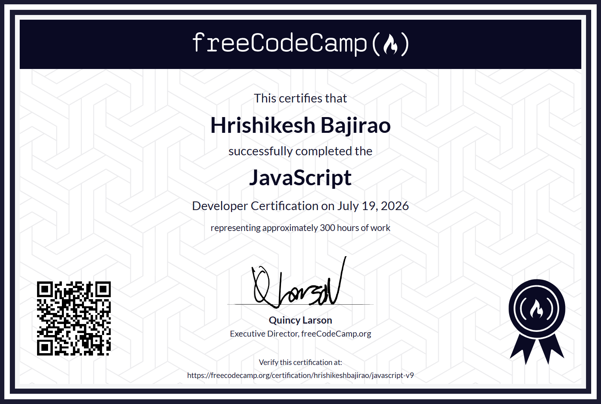

# freeCodeCamp - JavaScript Algorithms and Data Structures Certification

- Built a stronger foundation in **JavaScript** by combining **theory** with **practical implementation**.
- Practiced solving problems using **recursion** in multiple projects.
- Used **regular expressions** for tasks like validation and text filtering.
- Applied **modern array methods** (such as `map`, `filter`, `reduce`) to process data efficiently.
- Implemented **object-oriented programming (OOP)** concepts in interactive apps.
- Explored **functional programming** patterns for cleaner and more reusable code.
- Worked with **asynchronous** JavaScript, including **fetch** and **promises**, to handle API data.

## [Certificate](https://freecodecamp.org/certification/hrishikeshbajirao/javascript-v9)
[View Original](https://freecodecamp.org/certification/hrishikeshbajirao/javascript-v9)

## Certification Self Projects
1. Palindrome Checker Project
2. Roman Numeral Converter Project
3. Telephone Number Validator Project
4. Cash Register Project
5. Pokemon Search App Project

### [Guided Practice Projects (17)](https://github.com/HrishikeshBajirao/freeCodeCamp-JavaScript-Algorithms-and-Data-Structures-Certification/tree/main/Practice%20Projects)

1. Pyramid Generator (Introductory Javascript)
2. Role Playing Game (Basic Javascript)
3. Calorie Counter (Form Validation)
4. Building a Music Player (Basic Array and String Methods)
5. Date Formatter (Date Object)
6. Building Football team cards (Modern Javascript methods)
7. Building a ToDo App (localStorage)
8. Decimal to Binary Convertor (Recursion)
9. Spam Filter (Learn Regular Expressions)
10. Number Sorter (Basic Algorithmic Thinking)
11. Statistics Calculator (Advanced Array Methods)
12. Building a Spreadsheet (Functional Programming)
13. Building a Shopping Cart (Basic OOP)
14. Building a Platformer Game (Intermediate OOP)
15. fCC Authors Page (Learn fetch and promises)
16. fCC Forum Leaderboard (Learn Asynchronous Programming).
